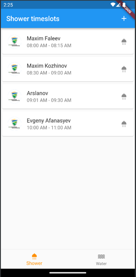
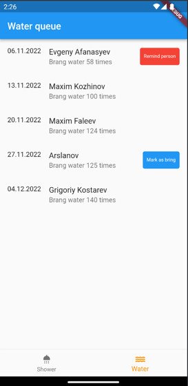

# smart_dorm

[//]: # (APK file: ![]&#40;apk-release.apk&#41;)

# Описание проекта

Приложение, помогающее студентам организовать студенческую жизнь в общежитии. Многие студенты во
время проживания с другими сталкиваются с проблемами, что другие сожители не выкидывают мусор,
забывают принести воду и забронивать комнату, чтобы позвать тяночку. Поэтому, мы решили запилить
приложение, которое поможет упорядочить рутину и избежать конфликты между соседями.

# Что уже сделало

- график приноса воды - можно посмотреть, кто сколько раз уже принес воды и кто "следующий" приносит
  воду. Это FIFO очередь с очередностью выкидывания мусора. Можно будет выкинуть мусор вне очереди -
  и твоя очередность сдвигается
- График работы душа по утрам - можно посмотреть график работы душа, забронировать удобный
  тайм-слот. Пока сделано только отображение из бд списка таймслотов на душ

# Скриншоты

Скриншот с очередностью душа
 

Скриншот с очередность выноса мусора

Лаунч-иконка

