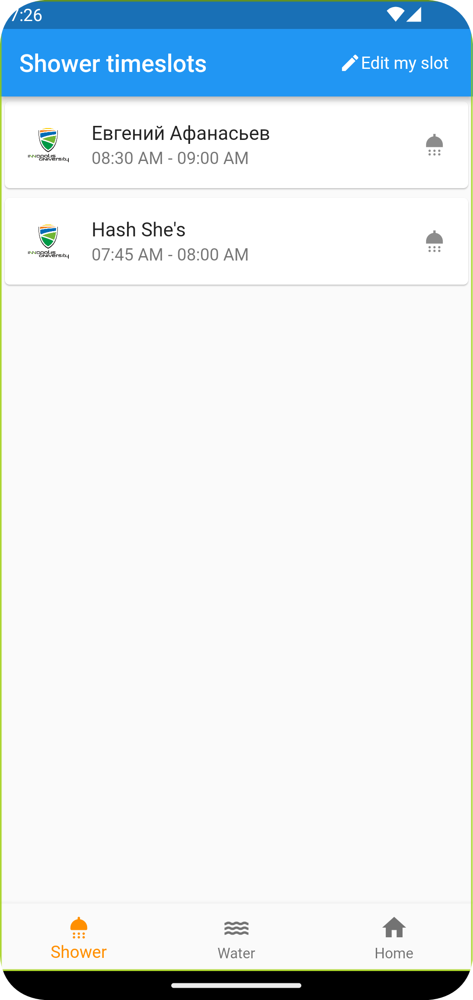
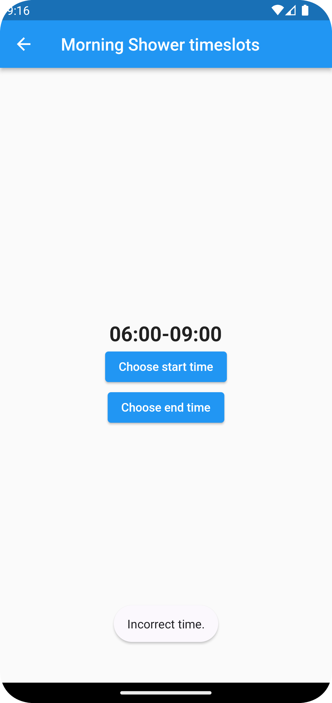
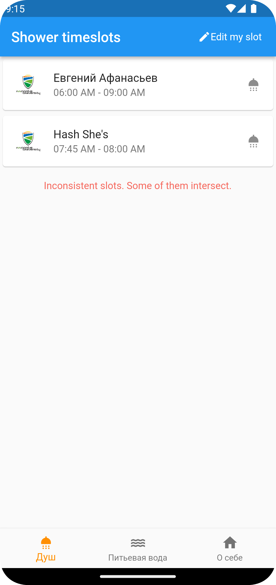
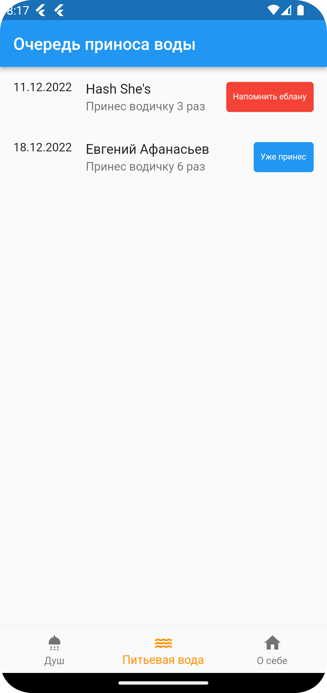
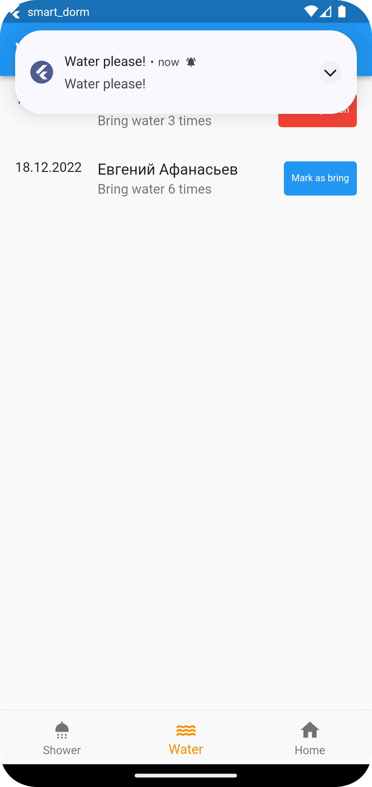
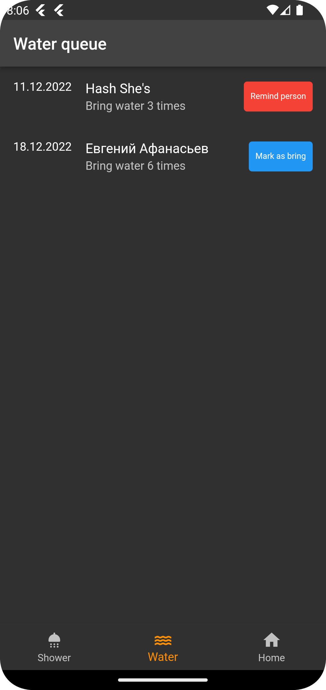
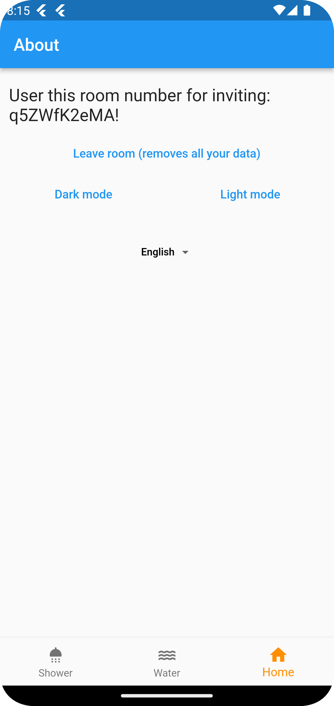
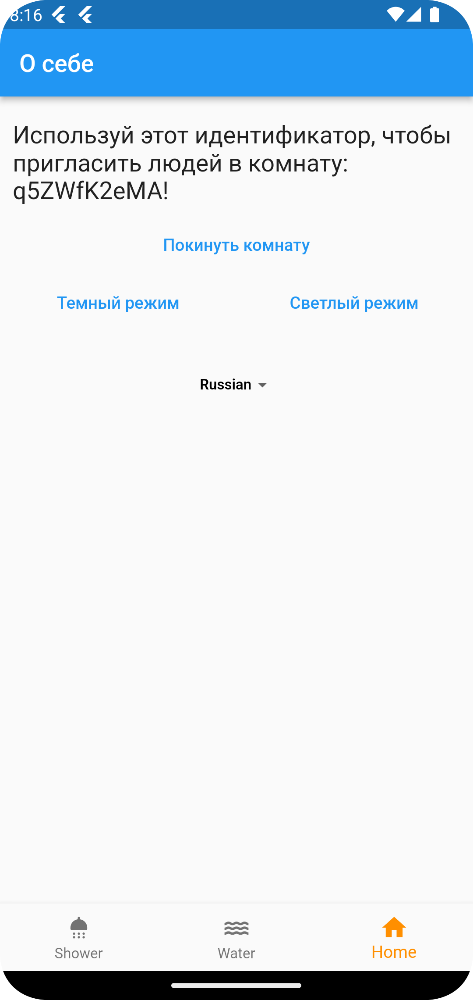

# smart_dorm

APK file: 

# Описание проекта

Приложение, помогающее студентам организовать студенческую жизнь в общежитии. Многие студенты во
время проживания с другими сталкиваются с проблемами, что другие сожители не выкидывают мусор,
забывают принести воду и забронивать комнату, чтобы позвать тяночку. Поэтому, мы решили запилить
приложение, которое поможет упорядочить рутину и избежать конфликты между соседями.

# Фичи

- график приноса воды - можно посмотреть, кто сколько раз уже принес воды и кто "следующий" приносит
  воду. Это FIFO очередь с очередностью выкидывания мусора. Можно будет выкинуть мусор вне очереди -
  и твоя очередность сдвигается
- График работы душа по утрам - можно посмотреть утренний график душа, редактировать свой таймслот
- Темная тема
- Локализация
- Авторизация (Google auth)

# Скриншоты
## Скриншот с очередностью душа 🛁

# Скриншоты с очередью для приноса воды 🚰

# Темная тема 🌑

# Локализация  🇬🇧

# Авторизация 🧏

